# Задание

## The Road Warrior

A major travel agency wants to build the next generation online trip management dashboard to allow travelers to see all of their existing reservations organized by trip either online of through their mobile device.

Users: 10,000+ registered users worldwide

### Requirements:

The system must interface with the agency’s existing airline, hotel, and car rental interface system to automatically load reservations via frequent flier accounts, hotel point accounts, and car rental rewards accounts.

Customers should be able to add existing reservations manually as well.

Items in the dashboard should be able to be grouped by trip, and once the trip is complete, the items should automatically be removed from the dashboard.

Users should also be able to share their trip information by interfacing with standard social media sites.

Richest user interface possible across all deployment platforms

### Additional Context:

must integrate seamlessly with existing travel systems

partnership deals are being negotiated to create 'favored' vendors

must work internationally

# Выполнение

## Бизнес-контекст

Необходимо разработать систему генерации дэшбордов туриста в разрезе путешествия для международной компании турагента.

## Бизнес-цели и бизнес драйверы

Цели общее:
1. Перевести пользователей на использование 
2. Завлечь больше клиентов за счет предоставления удобного и самого полного функциональностью сервиса 
3. Завлечь в партнерские соглашения больше вендоров предоставляющих услуги для путешественников (авиакомпании, отели, вендоры жд транспорта и тп) и сформировать из них костяк наиболее привелегированных для долгосрочного сотрудничества

Цели smart: 
1. Перевести 70% текущих пользователей на новую систему дэшбордов в течение года 
2. За следующий 2 года увеличить количество пользователей решения в 4 раза
3. Заключить не менее 10 партнерских соглашений с вендорами услуг для путешесвенников за следующие 2 года 

Бизнес-драйверы: 
1. Расширение доли рынка 
2. Расширение источников cash flow 
3. Повышение лояльности клиентов 
4. Создание win-win партнерской цепи "вендор" - "агрегатор" - "клиент" в  сфере турбизнеса

Арх-драйверы:
1. Масштабируемость (в том числе по миру)
2. Функциональная расширяемость
3. Расширяемость подключеных вендоров 

## Стейкхолдеров и их потребности
1. Путешественники - ключевые 
   1. Создание единого дэш борда со всей информацией по поедке (авиабилты, брони отелей, экскурсий и тп)
   2. Выгрузка "саммари о поездке" в соц сети (инста - тг блог - вк)
   3. Загрузка данных о бронях в "единое окно"
2. Туроператор - вспомогательные
   1. Генерация туров через платформу
   2. Получение оплаты через подписочную систему за использование дэшбордов
   3. Популяризация сервисча через соц сети за счет инфлюенсеров и обычных людей
3. Вендоры - вспомогательные
   1. Выявление "горячих" направлений
   2. Предоставление "акций" для отсутствия простоя

 ## Пользовательские истории
1. 
Как 
    пользователь 
я хочу 
    иметь возможность просмотра данных о поездке в формате "единого окна" 
чтобы 
    не искать сведения по различным блокам поездки в разных источниках 

2.  
Как 
    пользователь
я хочу 
    иметь возможность загрузить недостающие данные о поездке в ручном формате
чтоб
    все данные о поездке находились в едином пространстве 

3.  
Как
    пользователь
я хочу
    опубликовать "саммари" поездки в соц сети: инстаграмм + тг канал + прямая ссылка на просмотр в приложении / вэб интерфейсе
чтобы 
    похвастаться как круто у меня прошла поездка

4.  
Как 
    пользователь
я хочу 
    иметь возможность посмотреть аналитику своих путешествий с различными разрезами: стоимости / длительности и тп
чтобы 
    проанализилировать и предаться ностальгии по крутым поездкам 

1.  
Как 
    пользователь
я хочу 
    получить возможность построить маршруты любой сложности с предложениями по бронированию билетов и отелей от партнеров сервиса
чтобы 
    спланировать крутое путешествие 

1.  
Как
    пользователь
я хочу
    оплатить подписку
чтобы
    пользоваться дэшбордом

1.  
Как 
    туроператор
я хочу
    чтобы данные используемые в системах бронирования, аренды и авиаперевозок были интегрированы в приложение
чтобы 
    получить бесшовное переиспользование данных 

1.  
Как
    туроператор
я хочу
    отметить вендоров, которые имеют приоритет в поиске и предложениях 
чтобы
    предложить выгоду в партнерстве 

1.  
Как 
    вендор
я хочу
    предлагать свои услуги в дэшборде пользователя
чтобы 
    заработать денег на продаже 

## Атрибуты качества (и не функциональные требования)
### Критические характеристики
- Работа с пользователями по всему миру 
- Безопасность перс данных
- Легкость интеграции с новыми вендорами

### Критические функциональные сценарии
- Отображение дэшборда пользователя
- Интеграция данных из существующими системами
- Ввод доп данных о поездке
- Оплата подписки

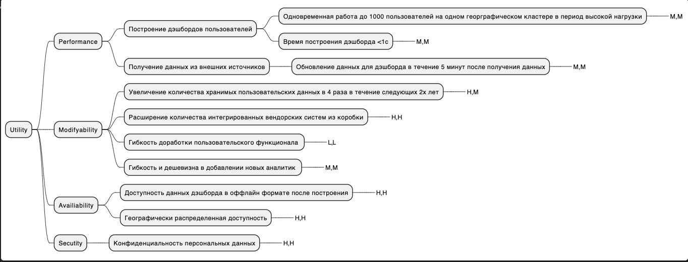

###  Атрибуты качества
1. Система должна поддерживать одновременную работу 1000 пользователей на одном географическом кластере
2. Система должна позволять увеличение производительности за счёт увеличения вычислительной мощности и ресурсов со стороны оборудования, а также за счет добавления дополнительных вычислительных узлов таким образом чтобы требования к производительности и к надежности не падали. 
3. Система должна позволять хранить данные 20000 пользователей в этом году из расчета на 4 поездки в год на 1 пользователя, где предполагается 2 перелета, 1 бронирование отеля, 1 бронирование автомобиля
4. Система должна позволять хранить локально у пользователя в мобильном приложении данные ближайшей поездки
5. Система должна позволять строить дэшбор поездки в течение 1с при заданых параметрах объемов хранимых данных и поддерживать это значение не менее чем в 5с при росте количества пользователей
6. Система должна демонстрировать уровень надёжности, при котором вероятность сбоя при обращении к критическим функциям не превышает 10%.

### НФТ
1. Система должна позволять масштабирование с учетом георграфической распределенности
2. Система должна поддерживать существующие интерфейсы интеграции с вендорскими системами турагентства
3. Система предполагает хранение персональных данных

## Контекстная схема системы
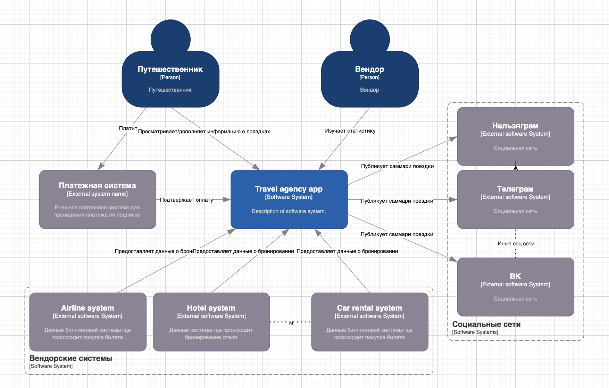

## ADL 
1. Решение об управлении ценностями Application Centric vs Data Centric

**Контекст** 
Туроагенство решает разработать приложение, которое бы отображало пользователю аналитический дэшборд с всеми данными, касающимися поездки пользователя. 
По мысли основная ценность приложения заключается в концентрации всей информации в одном месте по принципу "единого окна" из которого пользователь может удобным
образом управлять своей поездкой (бронированиями, билетами и т п.), а так же сможет генерировать отчеты и выгрузки в соц сети и т.п. 
**Решение**
Исходя из целей и контекста описанного выше - основной ценностью приложения являются данные клиентов и с учетом текущего и планируемого объема клиентов 
предполагается классифицировать решение как Data centric
Соответственно предполагается что основная нагрузка у приложения должна быть OLAP.  

Конкретные варианты технологического стека будут рассмотрены позднее, после того как будут проработаны более подробные принципы реализации
Основная идея в реализации на данном этапе состоит в архитектуре приложения с точки зрения управления данными. 

Как вариант использовать каппа архитектуру. 
Каппа архитектура позволяет организовывать хранилища данных и потоки управления ими таким образом что обрабатывать входящий поток данных по мере его поступления. 

**Альтернативы**
Рассмотреть приложение как Application Centric

**Плюсы/минусы**
+Управление данными в противовес управления процессами 
-Объем хранимых данных и сложность реализации хранилища/витрины

2. Возможность использования решений существующих на рынке

**Контекст** 
После того как определились с принципами организации приложения необходимо 
определиться с вариантами реализации. 
Основные конкурирующие гипотезы: 
+ Аутсорс 
+ Готовое решение
+ Инхаус разработка
**Решение**
Выбор между аутсорс или инхаус разработкой. Принципиальной разницы не имеет и в следствии чего 
возможно выбирать между ними исходя из показателей более приортетных конкретному бизнесу таких как: цена + поддержка разработки и наполнение новыми фичами. 
В конкретном случае выбор падает на разработку при помощи аутсорсинговой компании так как это дешевле и проще чем нанимать и содержать в штате собственный айти персонал 
в количестве требуемом для разработки
**Альтернативы**
Полностью готовое решение на рынке отсутствует. 
Решения не обладают готовыми коннекторами к существующим базам и потребуют доработки. 
Решения не удовлетворяют ключевым критериям таким как **безопасность перс данных** и не предоставляют **полноту кастомизации интерфейса**
**Плюсы/минусы**
Аутсорс в среднем будет дешевле чем полный инхаус за счет меньшего штата айти персонала требущего содержания. 
При этом ядро будет написано готовой командой профессионалов в сфере, которое уже перейдет на поддержку и будет дорабатываться сотрудниками компании. 

3. Работа с пользователями по всему миру
**Контекст** 
Решение нацелено на использование его пользователями со всего мира и соответственно предполагается что пользователи должны для своего удобства взаимодействовать
с интерфейсом на своем языке. 

**Решение**
Использовать сервис localise  
Переводы осуществляются только на топ-5 самых популярных языков в мире.
**Альтернативы**
POEditor - поулярное решение у больши компаний типа Ikea, но дорого
OneSky -  отсутствует SDK для adroid 
Ручная реализация - дорого, долго, и не настолько критично чтоб не было возможности использовать готовые решения

**Плюсы/минусы**
Удобный SDK под ios, android и хорошо документированный апи. 
Тарифы на любой вкус по относительно вменяемой стоимости и пробная бесплатная версия
Машинный перевод можно редактировать вручную, чтобы избежать ошибок автоматического перевода. Также можно заказать платный перевод всех меток для каждого языка носителем. Цена работы сразу отображается на странице с проектом

4. Решение по декомпозиции
**Контекст** 
См раздел "Декомпозиция".

**Решение**
Использовать вариант 2

**Альтернативы**
Вариант 1

**Плюсы/минусы**
Так как не требуется поддерживать всю историю данных, а также нет необходимости в хранении и загрузке "сырых" данных, целесообразнее использовать Каппа архитектуру. 
Основные преимущества состоят в простоте масштабируемости + унификации обработки данных + основной профиль получения данных из источников это стриминг. 

## Декомпозиция

### Модель
Ниже приведена общая доменная модель построенная при помощи Event storming 
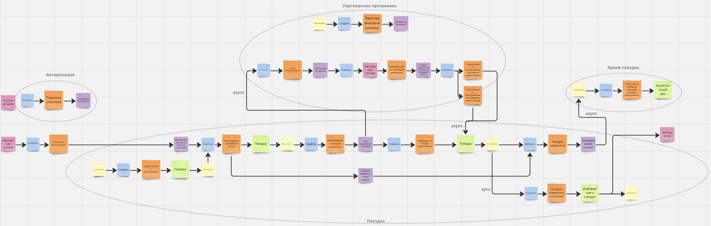

Основные события системы: 
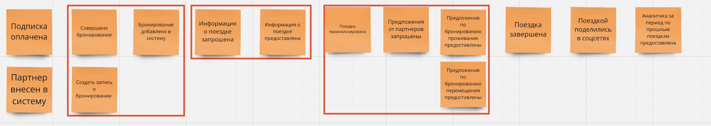

Основные функциональные контексты, которые удалось выявить: 
1) поездка
2) авторизация
3) партнерские программы
4) архив поездок

### Общий контекст data centric приложения
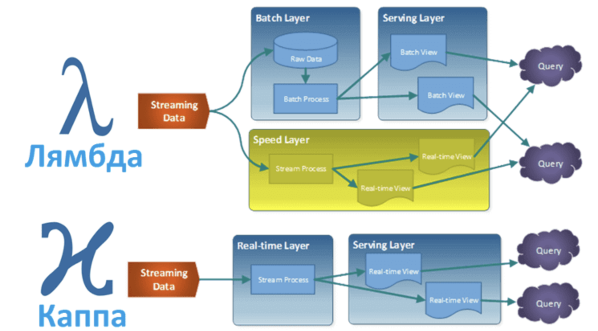

### Вариант 1
Вариант с использованием нескольких слоев данных. 
Слой хранения, где находятся обработанные данные о поездках пользователей
Слой приложения, на этом слое хранятся только данные на текущую дату + реализуется бизнес логика для всей функциональности
Слой клиентских данных - дублирует данные "витрины" для конкретного пользователя + реализует UI для пользователя

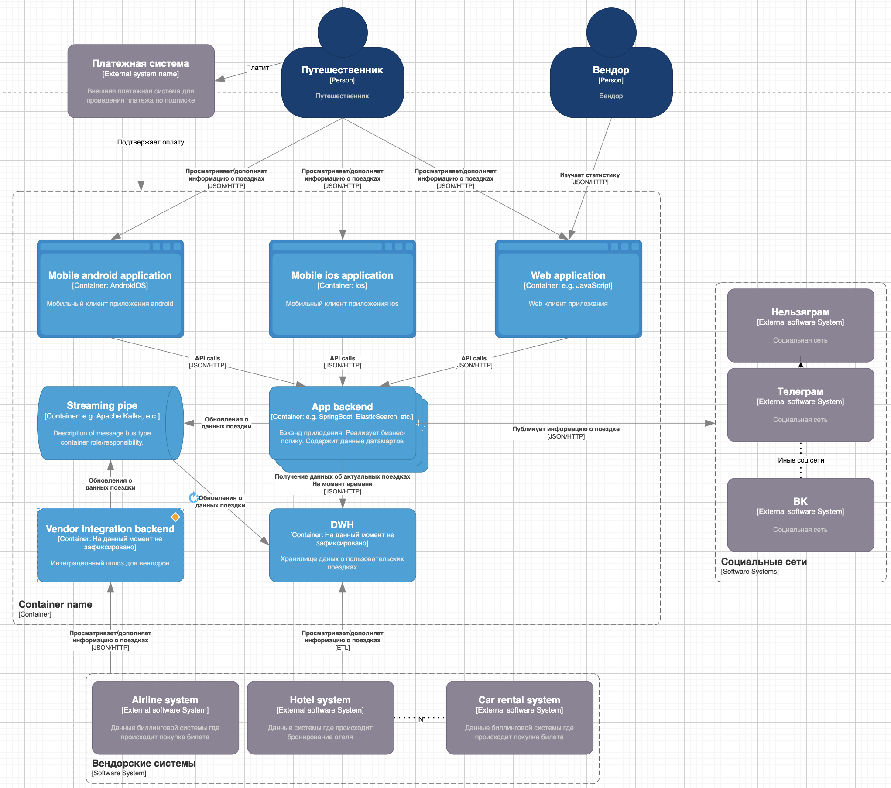

Основные функциональные контексты, которые удалось выявить: 
1) Пользовательский конекст
2) Контекст бизнес-логики
3) Конекст управления данными 

### Вариант 2
Вариант 2 не предусматривает полноценные слои данных. 
Предполагается что на уровне приложения содержатся все данные поездок с "сегодня" и в будущее. 
Раз в сутки производится процедура архивации, где данные о прошедших поездках удаляются, а статистически значимая информация перемещается в "архив".
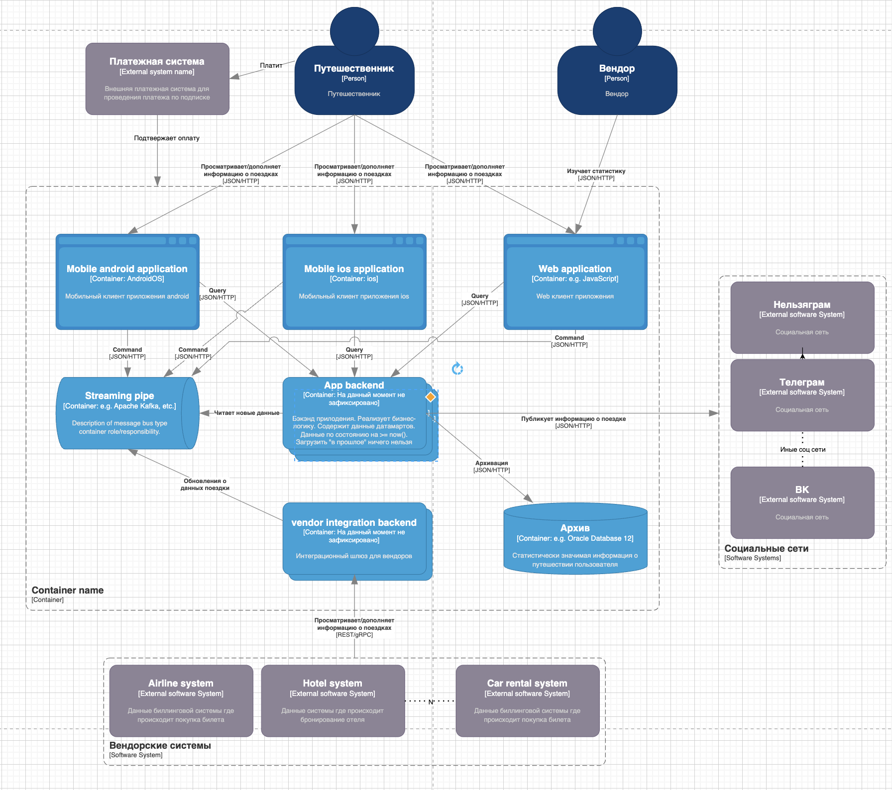

Основные функциональные контексты, которые удалось выявить: 
1) Пользовательский конекст
2) Контекст бизнес-логики
3) Архивное хранение

## Сценарии изменения
#### Сценарии изменения
Сценарии изменений описанные ниже опираются на критические сценарии + на арх драйверы. 
Сценарии:
1) Характер взаимодействия с вендорскими системами.
2) Добавление новых функциональных возможностей по отображению поездки для удовлетворения требования к наибольшей функциональной полноте пользовательского интерфейса
3) Расширение взаимодействия с партнерами в различных функциональных областях, например: появление новых предложений, скидок, возможность брони из интерфейса приложения и тп
4) Появление новых популярных соц сетей
5) Интеграция нового платежного инструмента
6) Отображение в одном интерфейсе поездок для N людей
7) Расширение ретроспективной аналитики как для вендоров, так и для путешественников
8) Внесение пользователями данных не только наперед, но и исторических данных

| N сценария    |Приоритет  | Вероятность   | Вариант 1 | Вариант 2 |
| -             | -         | -             | - | - |
| 1             | Высокий   | Высокая       | Легко. Поддерживается 2 способа обновления данных: batch + stream, любой новый источник подключается за O(1) время и деньги | Легко. Но для загрузки batch придется писать новые коннекторы |
| 2             | Высокий   | Высокая       | Может оказаться не самым простым делом, но есть возможность изменить структуру mart для удобства | Может потребоваться изменение структуры хранения данных для оптимизации или при появлении новых функций и тогда будет очень больно с миграциями |
| 3             | Средний   | Высокая       | Предоставление новой АПИ  | Одинаково с в1 |
| 4             | Низкий    | Высокая       | Легко | Одинаково с в1 |
| 5             | Низкий    | Средняя       | Легко | Одинаково с в1 |
| 6             | Средний   | Высокая       | Для мобилок - сложно. | Одинаково с в1 |
| 7             | Низкий    | Низкая        | Легко | Принципиально невозможно для исторических данных. Для новых - не сложно. |
| 7             | Низкий    | Низкая        | Легко | Посмотреть такие исторические поездки будет принципиально невозможно. Только отразить статистическую инфу |

В случае если объемы хранимых данных являются критичными - лучше выбирать второй вариант. Ограничения этого варианта проявляются в задачах с низким приоритетом. 
Если вопрос объемов хранимых данных не так критичен - лучше использовать первый вариант. Он полностью покрвыает все функциональные возможности второго + дает дополнительную гибкость + позволяет получать доп выгоду от хранимых пользовательких данных через партнерские соглашения. 

## Слой решения 
Основной вариант на котором остановились: Вариант 2
Для улучшения возможностей по масштабированию приложения, так как позволяет явным образом разделить 2 контекста: контекст загрузки данных о бронированиях и контекст работы  пользователя с дэшбордом поездки. 

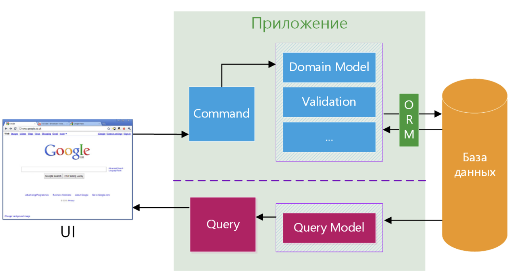

### Диаграмма контейнеров 

Бэкэнд бизнес логики приложения туроператора:
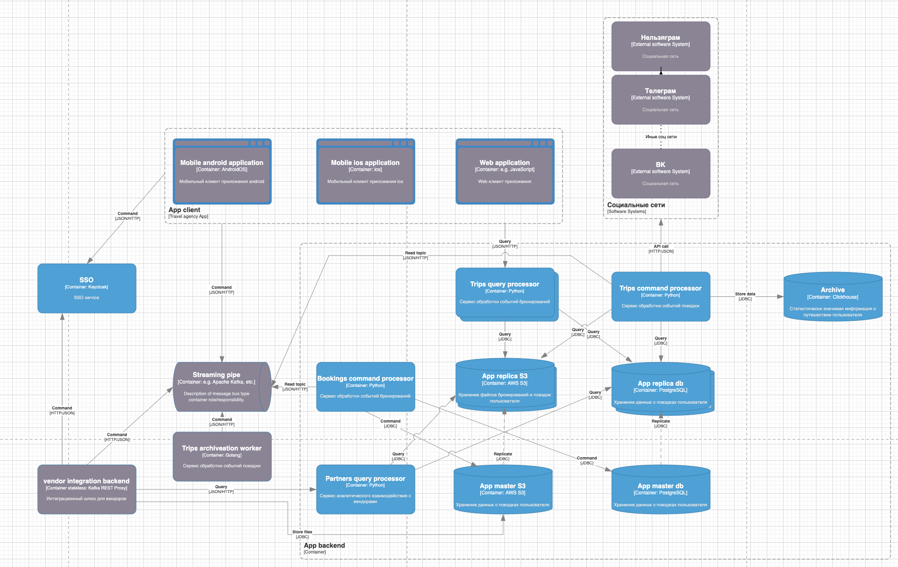

Мобильное приложение: 
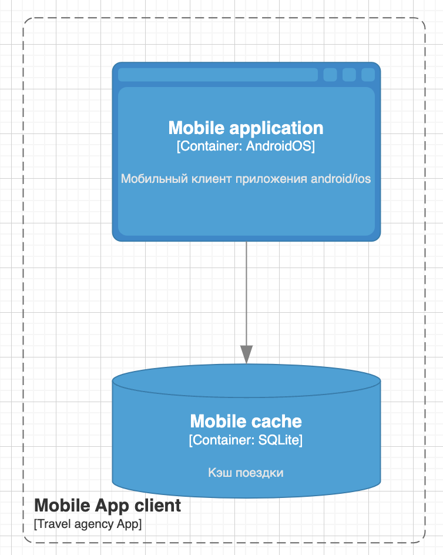

### Декомпозиция слоя БД

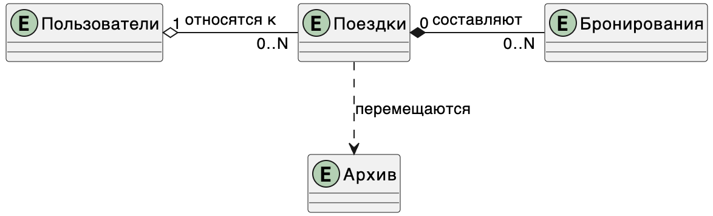

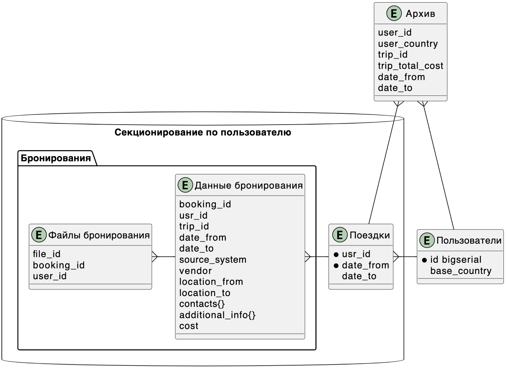

### Развертывание

Основное требование - работа с пользователями по всему миру. Соответственно развертывание должно поддерживать геораспределенные дата центра 
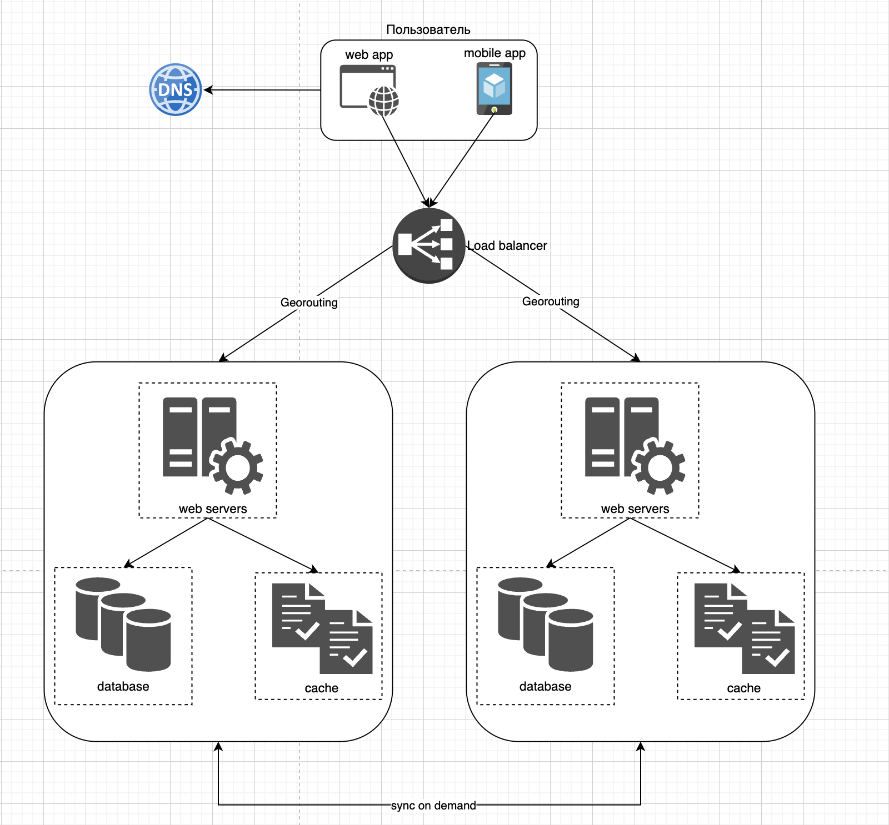

Каждый пользователь при создании учетки привязывается к определенному датацентру на основе указанной при регистрации страны. 

При запросе данных для дэшборда проверяются данные в ближайшем по геолокации датацентре и если их там нет, опрашивается датацентр основной геолокации, а данные кэшируются в центре ближайшем к пользователю. 

При добавлении в ручном режиме бронирования данные пишутся как в ближайший дата центра, так и в ДЦ привязанный к пользователю.

**Диаграмма развертывания на одном дата центре**
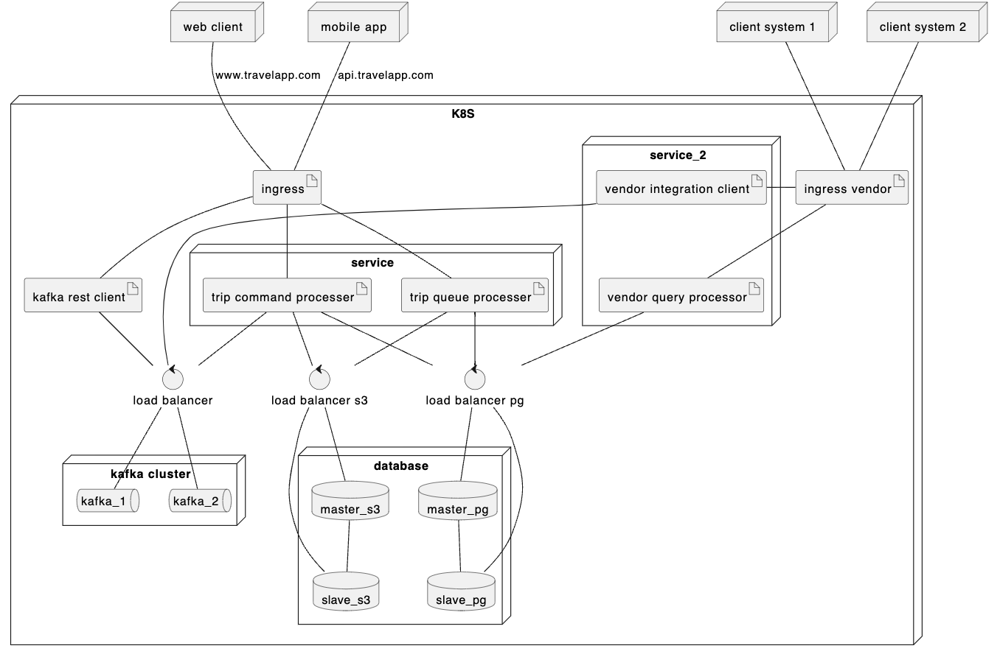
